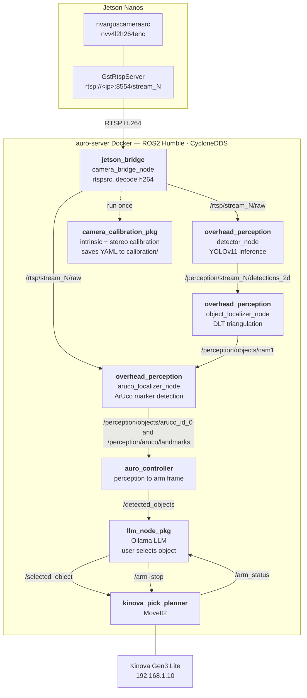

# Hey Jarvis, pick up the orange

This project implements a voice-commanded robotic pick-and-place pipeline
using multi-camera object localization, a robotic arm controller, and an LLM interface in ROS2.

---

## Architecture



---

## ROS2 Packages

All ROS2 nodes use ROS2 Humble and CycloneDDS (`RMW_IMPLEMENTATION=rmw_cyclonedds_cpp`).

| Package | Description | README |
|---|---|---|
| `src/jetson_bridge` | `camera_bridge_node` publishes RTSP streams as `sensor_msgs/Image` | [README](src/jetson_bridge/README.md) |
| `src/overhead_perception` | `detector_node` for YOLOv11 inference on each camera stream `aruco_localizer_node` for detecting ArUco markers on the reference camera, computes camera extrinsics and publishes object coordinates relative to the ArUco origin. `object_localizer_node` for multi-camera DLT triangulation using detector outputs and ArUco-derived extrinsics  | [README](src/overhead_perception/README.md) |
| `src/auro_controller` | Receives 3D object positions (ArUco frame) and ArUco placement from perception, transforms to arm frame, publishes `/detected_objects` | [README](src/auro_controller/README.md) |
| `src/kinova_pick_planner` | MoveIt2-based pick-and-place planner for Kinova Gen3 Lite | [README](src/kinova_pick_planner/README.md) |
| `src/llm_node_pkg` | Ollama LLM node. Accepts user object selection, triggers arm via `/selected_object` | [README](src/llm_node_pkg/README.md) |
| `src/camera_calibration` | Intrinsic (ChArUco and checkerboard) and stereo calibration nodes. Run once per camera setup; subscribes to `/rtsp/stream_{id}/raw` and saves YAML to `calibration/` | [README](src/camera_calibration/README.md) |

## Jetson scripts

| Path | Description |
|---|---|
| `jetson/rtsp_server.py` | GStreamer RTSP server (`gi.repository.GstRtspServer`). One instance per Jetson. Hardware H.264 encode via `nvv4l2h264enc`|
| `jetson/config.yaml` | Default camera parameters (resolution, fps, bitrate, port) |

---

## Dependencies & Setup

### Host requirements

- Docker (tested on Ubuntu 22.04)
- `tmux`
- SSH key access to each Jetson Nano

### Jetson setup (run once per Jetson)

```bash
sudo apt-get install -y python3-gi gir1.2-gst-rtsp-server-1.0
```

### Deploy files to Jetsons

The `jetson/` directory must exist on each Jetson at `$JETSON_REPO_PATH` (default: `~/auro-final-project`). Push updates with rsync:

```bash
# First time or after editing jetson/rtsp_server.py
./scripts/jetson_scripts/deploy_jetsons.sh 192.168.2.22 192.168.2.23 192.168.2.27 192.168.2.28
```

### Configure Jetson IPs

Edit these two files to match your LAN:

- `src/jetson_bridge/config/camera_bridge_config.yaml` — `rtsp_urls` field
- `scripts/jetson_scripts/run_jetsons_tmux.sh` — `JETSON_IPS` defaults

---

## Startup

### Step 0 — First-time setup

**Deploy Jetson files** (run once, or after editing `jetson/`):

```bash
./scripts/jetson_scripts/deploy_jetsons.sh 192.168.2.22 192.168.2.23 192.168.2.27 192.168.2.28
```

**Camera calibration** (run once per camera setup, requires the bridge to be running first):

```bash
# Intrinsic — one per camera stream
ros2 launch camera_calibration intrinsic_aruco_calibration.launch.py stream_id:=0

# Stereo — pairs of streams
ros2 launch camera_calibration stereo_aruco_calibration.launch.py
```

Calibration YAMLs are saved to `calibration/` and loaded by the localizer at runtime.

**Build the Docker image** (happens automatically on first run, but takes a few minutes):

```bash
docker build -f Dockerfile.server -t auro-server:latest .
```

### Step 1 — Start Jetsons

One tmux window per Jetson, each running the RTSP server process.

```bash
./scripts/jetson_scripts/run_jetsons_tmux.sh 192.168.2.22 192.168.2.23 192.168.2.25 192.168.2.26
```

Each Jetson serves `rtsp://<ip>:8554/stream0`. Detach with `Ctrl-b d`; streams keep running.

### Step 2 — Start perception pipeline

Runs four nodes in the `auro-server` Docker container:
- bridge: decodes RTSP streams, publishes `/rtsp/stream_{id}/raw`
- detector: YOLOv11 inference, publishes `/perception/stream_{id}/detections_2d`
- localizer: multi-camera DLT triangulation + ArUco calibration, publishes 3D object poses
- controller: transforms object positions to arm frame, publishes `/detected_objects`

```bash
./scripts/run_perception_control_tmux.sh [stream_ids]
```
```bash
#For MAC - Other Setup scripts are cross OS compatible
./scripts/run_perception_control_tmux_mac.sh "0,1,2,3"
```
```bash
# Example — two cameras (default):
./scripts/run_perception_control_tmux.sh "0,1"
```
```bash
# Four cameras:
./scripts/run_perception_control_tmux.sh "0,1,2,3"
```

| Tmux window | Node | Role |
|---|---|---|
| `Ctrl-b 0` bridge | `camera_bridge_node` | RTSP to ROS image topics |
| `Ctrl-b 1` detector | `detector_node` | YOLO object detection |
| `Ctrl-b 2` localizer | `object_localizer_node` + `aruco_localizer_node` | 3D triangulation |
| `Ctrl-b 3` controller | `auro_controller` | Transforms to arm frame |

### Step 3 — Start arm + LLM

Runs MoveIt2, the Kinova driver, the LLM node, and the arm controller in the `auro-server` Docker container.

```bash
./scripts/run_arm_llm_tmux.sh [robot_ip]
# robot_ip defaults to 192.168.1.10
```

| Tmux window | Role |
|---|---|
| `Ctrl-b 0` llm | LLM node (Ollama, keyboard input) |
| `Ctrl-b 1` kortex | Kortex hardware driver — start first |
| `Ctrl-b 2` moveit | MoveIt2 + RViz — start after kortex is up |
| `Ctrl-b 3` arm | Arm controller — waits 20s for MoveIt2 |

### Debug terminal

`scripts/helpers/run_docker_server.sh` drops into an interactive bash shell inside the `auro-server` container. It rebuilds the workspace on entry and is useful for manually running nodes, inspecting topics, or debugging.

```bash
./scripts/helpers/run_docker_server.sh
```

View rtsp video feed
```bash
ros2 run rqt_image_view rqt_image_view
```

### Cross-machine topic discovery (unicast peers)

If `ros2 topic list` shows no topics from the other machine, multicast is likely blocked on the network (common on lab/university switches). Set `CYCLONE_PEERS` to the remote machine's IP before running any startup script — the generated `cyclonedds_local.xml` will include explicit unicast peer addresses:

```bash
# On the laptop — point at the server
export CYCLONE_PEERS="<server-ip>"
./scripts/helpers/run_docker_server.sh        # or run_arm_llm_tmux.sh

# On the server — point at the laptop (if needed)
export CYCLONE_PEERS="<laptop-ip>"
./scripts/helpers/run_docker_server.sh        # or run_perception_control_tmux.sh
```

Multiple peers are space-separated: `export CYCLONE_PEERS="192.168.2.3 192.168.2.5"`

---

## Topic Map

| Topic | Type | Publisher | Subscriber |
|---|---|---|---|
| `/rtsp/stream_{id}/raw` | `sensor_msgs/Image` | `camera_bridge_node` | `detector_node`, `aruco_localizer_node` |
| `/perception/stream_{id}/detections_2d` | `vision_msgs/Detection2DArray` | `detector_node` | `object_localizer_node` |
| `/overhead/objects/info` | `std_msgs/String` (JSON) | `object_localizer_node` | `auro_controller` |
| `/detected_objects` | `std_msgs/String` (JSON) | `auro_controller` | `llm_node` |
| `/selected_object` | `std_msgs/String` (JSON) | `llm_node` | `arm_controller` |
| `/arm_status` | `std_msgs/String` | `arm_controller` | `llm_node` |
| `/arm_stop` | `std_msgs/Bool` | `llm_node` | `arm_controller` |

---

## Configuration

| File | Controls |
|---|---|
| `src/jetson_bridge/config/camera_bridge_config.yaml` | Jetson IPs, stream IDs, RTSP jitter buffer |
| `src/overhead_perception/config/detector.yaml` | YOLO model path, confidence threshold, max fps |
| `src/overhead_perception/config/object_localizer_config.yaml` | Triangulation parameters, publish rate |
| `src/overhead_perception/config/aruco_localizer_config.yaml` | ArUco marker size, IDs, update rate |
| `scripts/helpers/cyclonedds.xml` | CycloneDDS static config template (runtime config auto-generated as `cyclonedds_local.xml`) |
| `jetson/config.yaml` | Default camera resolution, fps, H.264 bitrate |
